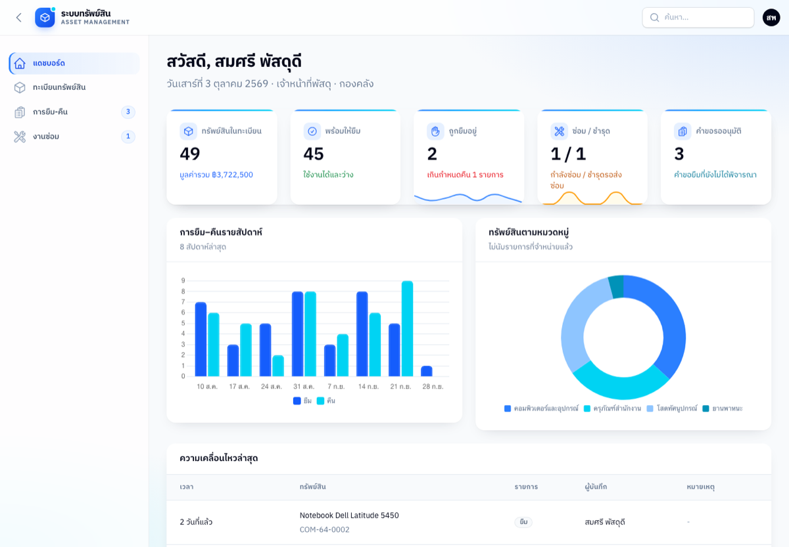
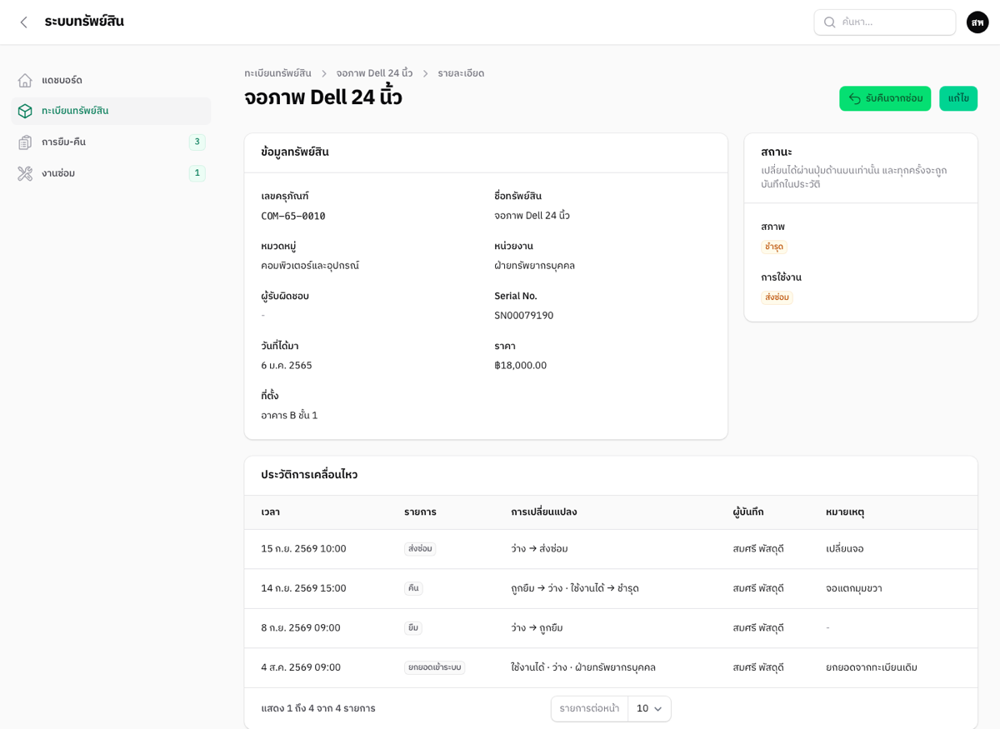
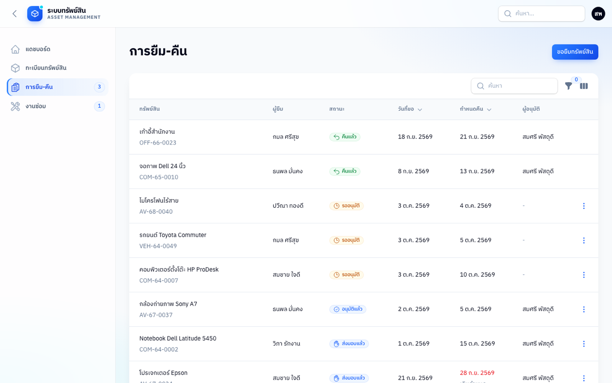

# ระบบบริหารทรัพย์สิน

ระบบทะเบียนครุภัณฑ์สำหรับองค์กร: ลงทะเบียน ยืม–คืน ส่งซ่อม โอนย้ายหน่วยงาน และจำหน่าย แยกสิทธิ์ 3 บทบาท

**Laravel 13 · Filament 5 · SQLite · PHPUnit**

**ลองใช้:** https://asset-laravel.onrender.com เลือกบทบาทแล้วเข้าใช้ได้ทันที ข้อมูลเป็นตัวอย่างทั้งหมด (เปิดครั้งแรกอาจต้องรอประมาณ 1 นาที)



## ทำอะไรได้บ้าง

| บทบาท | ทำได้ |
|---|---|
| พนักงาน | ดูทรัพย์สินของหน่วยงานตัวเอง และยื่นคำขอยืม |
| เจ้าหน้าที่พัสดุ | ลงทะเบียน แก้ไข อนุมัติ ส่งมอบ รับคืน ส่งซ่อม โอนย้าย และจำหน่าย |
| ผู้ดูแลระบบ | ทุกอย่างข้างบน รวมถึงจัดการผู้ใช้ หน่วยงาน หมวดหมู่ และลบทรัพย์สิน |

นอกจากนี้ยังมี:
- **ประวัติการเคลื่อนไหว** ของทรัพย์สินแต่ละชิ้น ตั้งแต่ยกยอดเข้าระบบ
- **dashboard** สรุปตามสถานะ
- **ตัวกรองรายการเกินกำหนดคืน**
- **วันที่แสดงเป็น พ.ศ. ตามเวลาไทย**

| ประวัติของทรัพย์สิน | การยืม–คืน |
|---|---|
|  |  |

## การออกแบบที่สำคัญ

**1. ทุกการเปลี่ยนสถานะผ่านทางเดียว** — [`app/Services/AssetLedger.php`](app/Services/AssetLedger.php)
ทุกครั้งที่สถานะเปลี่ยน ระบบจะอัปเดตทรัพย์สินและเพิ่มแถวใน `asset_movements` ใน transaction เดียวกัน ประวัติจึงอธิบายสถานะปัจจุบันได้เสมอ ฟอร์มแก้ไขไม่มีช่องสถานะ และ `condition`, `availability`, `department_id` ไม่อยู่ใน `$fillable`

**2. สถานะแยกเป็น 2 แกน** คือ `condition` (ใช้งานได้ / ชำรุด / จำหน่ายแล้ว) และ `availability` (ว่าง / ถูกยืม / ส่งซ่อม)
ถ้าใช้ enum ตัวเดียว จะเก็บกรณีอย่าง "ชำรุด แต่ยังไม่ได้ส่งซ่อม" ไม่ได้

**3. กฎสำคัญบังคับที่ database** — [migration](database/migrations/2026_10_03_000000_create_asset_management_tables.php)
- partial unique index ทำให้ทรัพย์สินหนึ่งชิ้นมีคำขอยืมที่อนุมัติแล้วได้ทีละรายการเท่านั้น
- partial unique index บน `asset_tag WHERE deleted_at IS NULL` ทำให้นำเลขครุภัณฑ์ที่ลบไปแล้วกลับมาใช้ใหม่ได้
- trigger ห้ามแก้หรือลบ `asset_movements` (append-only) ถ้าบันทึกผิด ให้เพิ่มรายการปรับปรุงแทน
- trigger ห้ามจำหน่ายทรัพย์สินที่ยังไม่ว่าง

แม้โค้ดฝั่งแอปจะมี bug กฎพวกนี้ก็ยังทำงาน

**4. Compare-and-set กันการกดพร้อมกัน**
UPDATE จะมีผลเฉพาะเมื่อสถานะในแถวยังเป็นค่าที่อ่านมา ถ้ามีคนเปลี่ยนไปก่อน ระบบจะแจ้งให้โหลดหน้าใหม่ ใช้ทั้งกับทรัพย์สินและคำขอยืม

**5. สิทธิ์ของทรัพย์สินและผู้ใช้กำหนดใน Laravel Policy** — [`app/Policies`](app/Policies)
Filament ใช้ policy ตัดสินทุกปุ่ม รวมถึงการลบหลายรายการ ซึ่งจะเช็กทีละรายการ ทรัพย์สินที่ถูกยืม อยู่ระหว่างซ่อม หรือมีคำขอที่อนุมัติแล้ว จะลบไม่ได้

## รันในเครื่อง

ต้องมี PHP 8.3+ (พร้อม extension `intl`, `pdo_sqlite`) และ Composer

```bash
composer install
cp .env.example .env
php artisan key:generate
touch database/database.sqlite
php artisan migrate --seed
php artisan serve
```

เปิด http://127.0.0.1:8000

**บัญชีทดลอง** (รหัสผ่าน `password` ทุกบัญชี): `officer@demo.test`, `staff@demo.test`, `admin@demo.test`

ถ้าตั้ง `APP_DEMO=true` ใน `.env` หน้า login จะมีปุ่มเข้าใช้ทันทีแยกตามบทบาท และระบบจะ reset ข้อมูลตัวอย่างทุกคืน
**ห้ามเปิดโหมดนี้กับข้อมูลจริง**

## Deploy (demo)

demo รันบน [Render](https://render.com) แผนฟรี ตั้งค่าทั้งหมดอยู่ใน repo:
- [`render.yaml`](render.yaml): Blueprint ของ Render
- [`Dockerfile`](Dockerfile): image ที่ใช้ FrankenPHP รัน Laravel
- [`docker/start.sh`](docker/start.sh): seed ข้อมูลตัวอย่างใหม่ทุกครั้งที่ server เริ่ม เพราะแผนฟรีไม่มี disk ถาวร ข้อมูลจึง reset เองทุกครั้งที่ server ตื่น

**Render deploy เฉพาะ branch `deploy`** branch นี้มี GitHub ruleset ห้ามทุกคน push ลบ หรือ force-push ยกเว้น admin ของ repo

ขั้นตอน deploy:

```bash
git push origin main:deploy
```

แผนฟรีจะหลับเมื่อไม่มีคนเข้า 15 นาที คนแรกที่เข้ามาหลังจากนั้นต้องรอประมาณ 1 นาที

## Test

```bash
php artisan test
```

มี 35 test แบ่งเป็น 3 กลุ่ม:
- [`AssetLedgerTest`](tests/Feature/AssetLedgerTest.php): เช็กว่ากฎใน database ทำงานจริง โดยบางข้อเขียนข้อมูลตรงเข้า database ข้ามโค้ดแอป
- [`PanelTest`](tests/Feature/PanelTest.php): กดปุ่มจริงใน Filament และเช็กสิทธิ์ของแต่ละบทบาท
- `ThaiDate`: เช็กการแสดงวันที่เป็น พ.ศ.

ทดสอบใน browser จริงด้วย [`tests/Browser/smoke.mjs`](tests/Browser/smoke.mjs) ต้องใช้ Node 22 ขึ้นไปและ Chrome สคริปต์จะ:
- เปิดทุกหน้าตามบทบาท แล้วตรวจว่าไม่มี console error และไม่มี request ที่ล้มเหลว
- ตรวจว่า ESC ปิด modal ได้
- ตรวจว่าปุ่ม back/forward ของ browser ทำงานถูก
- ตรวจหน้า 403 และ 404

ใช้ได้ทั้งกับเครื่อง dev และเว็บจริง (`node tests/Browser/smoke.mjs <url>`)

checklist ที่ใช้ตรวจก่อน deploy อยู่ที่ [`docs/QA-CHECKLIST.md`](docs/QA-CHECKLIST.md)

## ข้อจำกัดที่รู้อยู่

- **ผูกกับ SQLite:** trigger เขียนด้วย syntax ของ SQLite ถ้าย้ายไป PostgreSQL ต้องเปลี่ยนเป็น `CHECK` constraint และ rule หรือ trigger ของ Postgres
- **เวลาเก็บเป็นเวลาไทย:** ใช้ `Asia/Bangkok` ไม่ใช่ UTC เพราะตั้งใจให้ใช้ในองค์กรไทยที่มีเขตเวลาเดียวเท่านั้น
- **อนุมัติได้ชั้นเดียว:** ถ้าต้องการอนุมัติหลายชั้น ต้องเพิ่มตารางขั้นการอนุมัติแยกออกมา
- **ยังไม่มี:** ระบบนำเข้าข้อมูลจากทะเบียนเดิม, แนบรูป, การแจ้งเตือนทางอีเมล และการคำนวณค่าเสื่อมราคา
